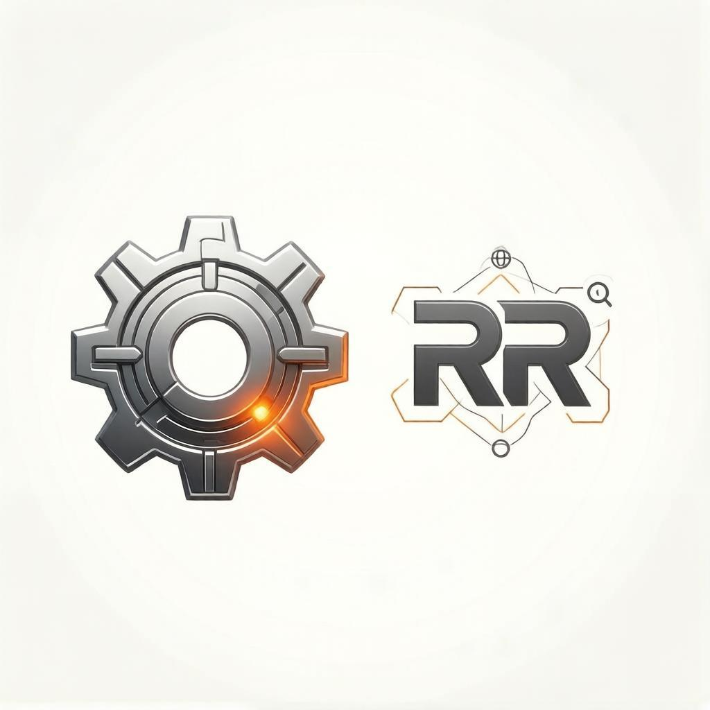

## RemRobot

> ВАЖНО! Приложение не использует существующие реальные схемы оборудования Конвертерного цеха №2 и не раскрывает информацию, которая может являться коммерческой тайной.

> Все задействованные в программе данные взяты из открытых источников, а привязка к оборудованию котла-охладителя и газоотводящего тракта Конвертерного цеха №2 носит условный характер, и предназначена только для демонстрации возможностей программы.

RemRobot - современный цифровой помощник ремонтных служб для своевременного и продуманного планирования бюджета на закупку ТМЦ и мониторинга обслуживаемого оборудования в реальном времени.

На данный момент бюджетирование строится таким образом, что ремонтные службы закладывают лимиты на закупку ТМЦ на будущий год исходя из опыта ремонта агрегатов в своей зоне обслуживания и стоимости ТМЦ, прописанной в ОЗМ САПа. А при отсутствии ОЗМ закладывается условная сумма.

Проработка альтернатив через отдел закупок происходит только после выделения лимитов и согласования потребностей в САПе.

В условиях сложной экономической ситуации и необходимостью экономии средств требуется вести грамотное планирование бюджета.

RemRobot позволяет отслеживать износ оборудования в реальном времени (путем подключения программы к ИИСДУ), мониторить наличие ОЗМ в САПе (путем подключения программы к САП) и искать с помощью ИИ аналоги в интернете.

> Для демонстрации возможностей программы тебуется активировать виртуальное окружение:
> source venv/bin/activate

> Запуск производится командой:
> python3 app.py

> Проверка работоспособности: точка 13 -> Задвижка Ду300 Ру40 -> Поиск аналогов